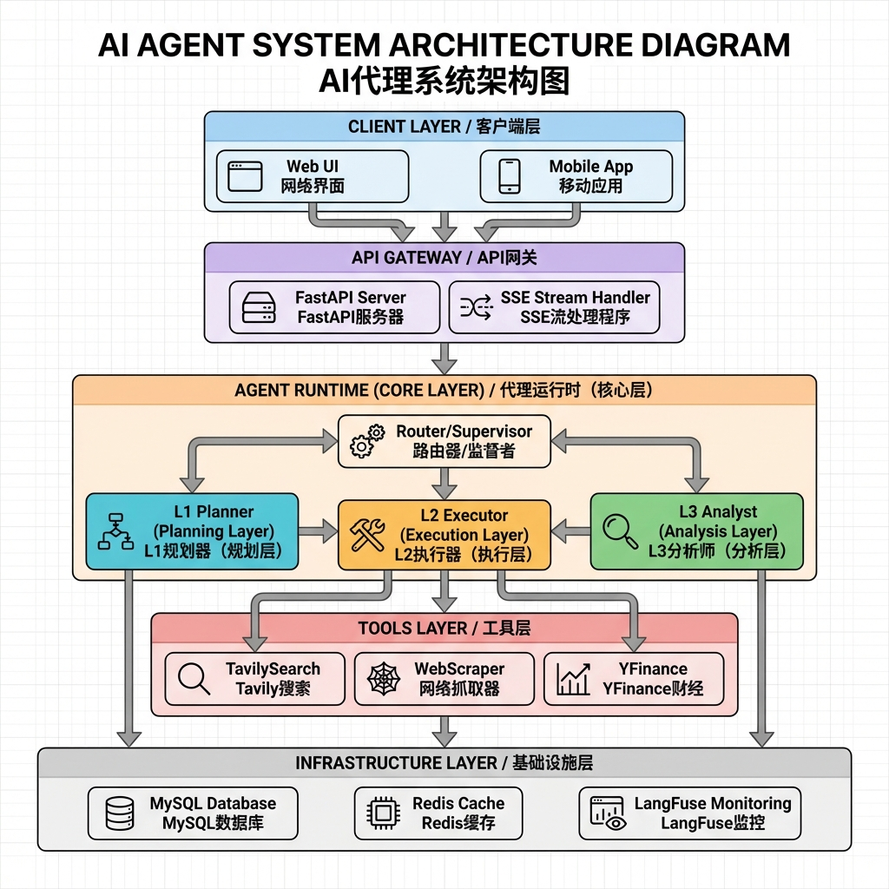
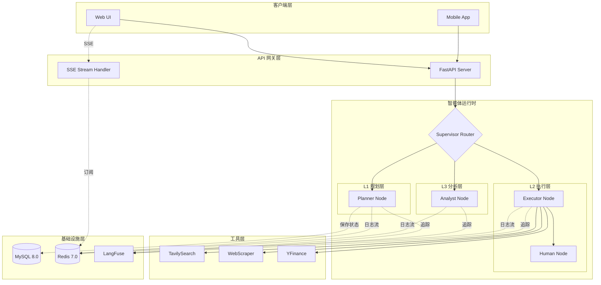
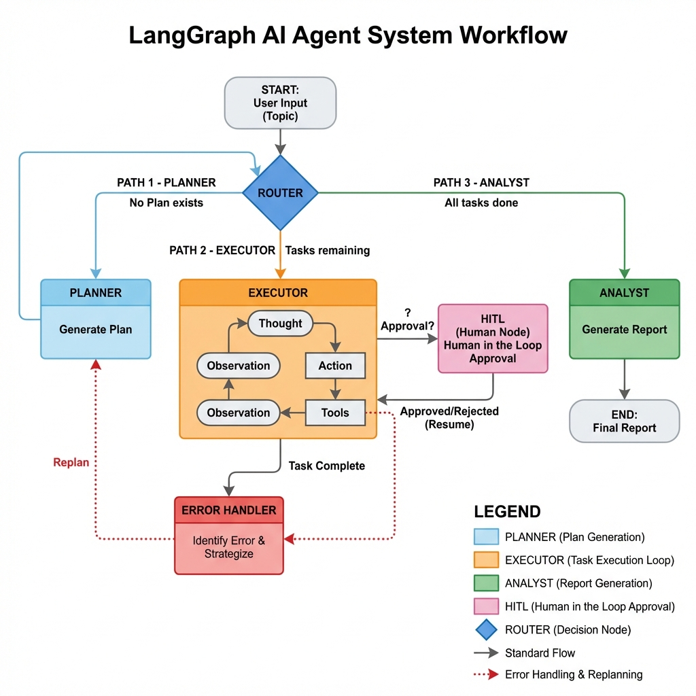
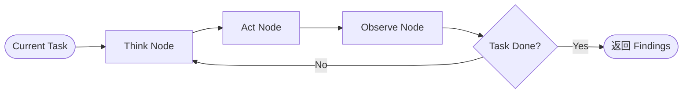
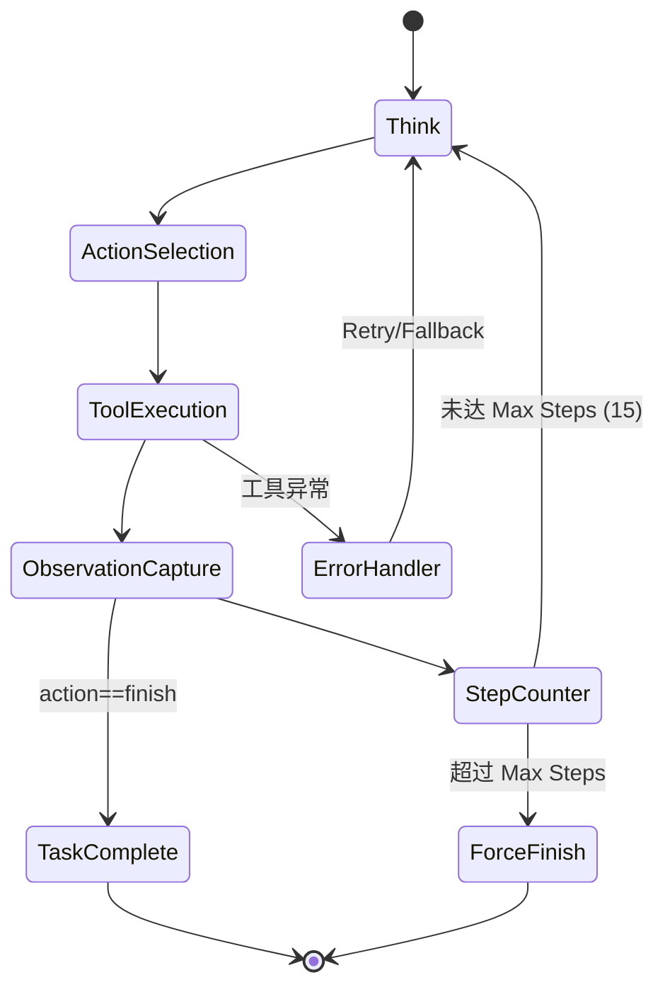
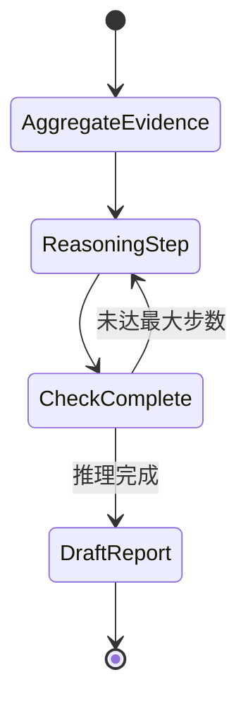
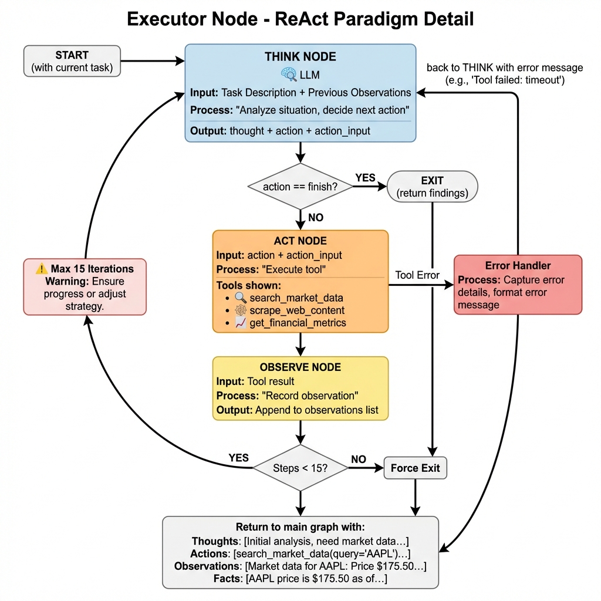
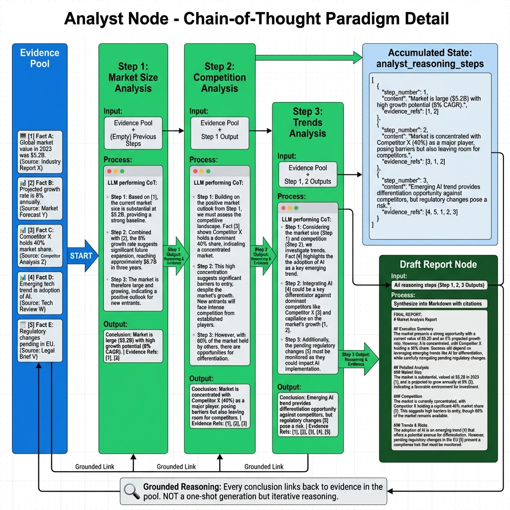

# ProAgent 系统架构设计文档 v1.0

> **Industry Research Agent** - Production-Grade Multi-Paradigm System

---

## 📋 文档概览

本文档详细定义了 ProAgent 的完整架构设计，包括：
1. 系统架构与组件关系
2. LangGraph Workflow 设计
3. 节点详细规范与工具映射
4. 数据流与状态管理
5. API 接口规范

---

## 1. 系统架构 (System Architecture)

### 1.1 总体架构图

**渲染图:**



<details>
<summary>点击查看 Mermaid 源码（可编辑）</summary>



</details>

### 1.2 核心组件说明

| 层级 | 组件 | 职责 |
|:---|:---|:---|
| **客户端层** | Web UI / Mobile | 用户交互界面 |
| **API 层** | FastAPI | REST API + SSE 协议 |
| **运行时** | LangGraph Workflow | 智能体编排引擎 |
| **工具层** | Search/Scrape/Finance | 外部数据获取 |
| **基建层** | MySQL/Redis/LangFuse | 持久化/缓存/监控 |

---

## 2. LangGraph Workflow 设计

### 2.1 完整工作流图

**渲染图:**



<details>
<summary>点击查看 Mermaid 源码（可编辑）</summary>



</details>

```mermaid
graph TD
    Start([用户输入: Topic]) --> Router{Router}
    
    %% L1 Planning
    Router -->|无计划| Planner[Planner Node]
    Planner -->|生成 Plan| Router
    
    %% L2 Execution
    Router -->|有待执行任务| Executor[Executor Node]
    Executor -->|工具调用| Tools[Tools: Search/Scrape/Finance]
    Tools -->|返回结果| Executor
    
    Executor -->|需人工审核| HITL[Human Node]
    HITL -->|Approve| Executor
    HITL -->|Reject| Planner
    
    Executor -->|任务完成| Router
    
    %% L3 Analysis
    Router -->|所有任务完成| Analyst[Analyst Node]
    Analyst -->|生成报告| End([Final Report])
    
    %% Error Recovery
    Executor -.异常.-> ErrorHandler[Error Handler]
    ErrorHandler -.重规划.-> Planner
    
    style Planner fill:#e1f5fe
    style Executor fill:#fff3e0
    style Analyst fill:#e8f5e9
    style HITL fill:#fce4ec
```

### 2.2 状态流转逻辑

```python
def route_logic(state: AgentState) -> str:
    # 1. 检查是否有计划
    if not state.get("plan"):
        return "planner"
    
    # 2. 检查当前任务索引
    idx = state.get("current_step_index", 0)
    plan = state["plan"]
    
    # 3. 如果还有待执行任务
    if idx < len(plan):
        current_task = plan[idx]
        
        # 3.1 如果任务需要人工审核
        if current_task.status == "pending_approval":
            return "human_node"
        
        # 3.2 正常执行
        return "executor"
    
    # 4. 所有任务完成，进入分析
    return "analyst"
```

---

## 3. 节点详细设计 (Node Specifications)

### 3.1 L1 Planner Node (规划节点)

#### 功能描述
将用户的研究主题分解为结构化的执行计划。

#### 输入/输出

**Input:**
```python
{
    "topic": str,               # 研究主题
    "error_state": Optional[str] # 错误信息（重规划模式）
}
```

**Output:**
```python
{
    "plan": List[PlanStep],     # 任务清单
    "current_step_index": 0
}
```

#### 使用的工具
- **无外部工具**（纯 LLM 推理）

#### 使用的模型
- `gpt-4-turbo` (高智商模型，用于复杂规划)
- Temperature: `0.7` (适度创造性)

#### Prompt 策略
```
System: 你是一位资深的行业研究分析师。
任务：将复杂的研究话题拆解为逻辑清晰、顺序合理的子任务。
要求：
1. 每个步骤必须是原子化的（单一职责）
2. 明确依赖关系（步骤 B 依赖步骤 A 的输出）
3. 使用结构化 JSON 输出

典型研究流程:
- 市场定义与规模
- 竞争格局分析
- 趋势与驱动因素
- 风险与挑战
```

#### 关键特性
- ✅ **动态重规划**: 根据执行反馈调整计划
- ✅ **结构化输出**: 强制 Pydantic 校验，杜绝格式错误

---

### 3.2 L2 Executor Node (执行节点)

#### 功能描述
基于 ReAct 范式执行单个原子任务，通过**显式的 Think→Act→Observe 循环**获取外部数据。

> ⚠️ **设计原则**: 不使用 `create_react_agent`，使用原始节点实现，确保每个 Thought 和 Observation 都可追踪。

#### 输入/输出

**Input:**
```python
{
    "plan": List[PlanStep],
    "current_step_index": int
}
```

**Output:**
```python
{
    "current_step_index": int + 1,
    "research_findings": List[Fact],
    "executor_trace": {  # 新增：完整 ReAct 轨迹
        "thoughts": List[str],
        "actions": List[Dict],
        "observations": List[str]
    }
}
```

#### 子节点设计 (Executor Subgraph)

Executor 内部是一个独立的 ReAct Subgraph:



**1. Think Node (思考节点)**
- **职责**: 分析当前 observations，决定下一步 action
- **输入**: 当前任务描述 + 历史 observations
- **输出**: `thought` (推理过程) + `action` (工具名) + `action_input` (参数)

**2. Act Node (行动节点)**
- **职责**: 执行选定的工具
- **输入**: `action`, `action_input`
- **输出**: 无 (直接调用工具)

**3. Observe Node (观察节点)**
- **职责**: 记录工具返回结果，判断是否完成任务
- **输入**: Tool 执行结果
- **输出**: `observation` + `task_complete` (bool)

#### 使用的工具映射表

| 工具名 | 用途 | 输入参数 | 输出 | 缓存策略 |
|:---|:---|:---|:---|:---|
| `search_market_data` | 实时市场搜索 | `query: str` | `List[{title, url, snippet}]` | Redis TTL 24h |
| `scrape_web_content` | 深度内容抓取 | `url: str` | `str` (4000 chars) | 无缓存 |
| `get_financial_metrics` | 财报数据查询 | `ticker: str` | `Dict[metrics]` | Redis TTL 1h |

#### 使用的模型
- `gpt-4o-mini` (快速响应模型)
- Temperature: `0` (精确执行)

#### Think Node Prompt 策略
```
System: 你是一个任务执行代理。

Current Task: {task_description}
Previous Observations: {observations}

Available Tools:
- search_market_data(query): 搜索市场信息
- scrape_web_content(url): 抓取网页内容
- get_financial_metrics(ticker): 获取财报数据

要求：
1. 分析当前进展（Thought）
2. 如果信息充分，选择 action="finish"
3. 否则选择合适的工具并明确参数

输出格式 (JSON):
{
  "thought": "当前分析...",
  "action": "search_market_data",
  "action_input": "2024 AI market size"
}
```

#### ReAct Loop 设计



#### 鲁棒性机制
1. **Max Steps 限制**: 15 步硬限制，防止死循环
2. **Tool Rescue**: 工具异常自动捕获 → Agent 重新思考备选方案
3. **Context Window 保护**: 每 5 轮压缩 observations，保留关键信息

#### 关键代码结构

```python
def executor_subgraph():
    # 定义 Executor 的内部 StateGraph
    class ExecutorState(TypedDict):
        task_desc: str
        thoughts: List[str]
        observations: List[str]
        current_step: int
        finished: bool
    
    # 创建子图
    subgraph = StateGraph(ExecutorState)
    subgraph.add_node("think", think_node)
    subgraph.add_node("act", act_node)
    subgraph.add_node("observe", observe_node)
    
    # 循环逻辑
    subgraph.add_conditional_edges("observe", 
        lambda s: "think" if not s["finished"] else END
    )
    
    return subgraph.compile()
```

---

### 3.3 L3 Analyst Node (分析节点)

#### 功能描述
汇总所有事实，进行**显式多步 CoT 推理**，生成引用完整的深度报告。

> ⚠️ **设计原则**: 不是一次性生成报告，而是通过多个推理步骤逐步构建洞察。

#### 输入/输出

**Input:**
```python
{
    "research_findings": List[Fact],
    "topic": str
}
```

**Output:**
```python
{
    "analyst_reasoning_steps": List[Dict],  # 新增：显式推理步骤
    "final_report": str
}
```

#### 子节点设计 (Analyst Subgraph)

Analyst 内部包含多个推理步骤：


**推理步骤定义**:
```python
{
    "step_number": int,
    "step_name": str,  # e.g., "市场规模分析"
    "content": str,    # 推理内容
    "evidence_refs": List[int],  # 引用的 Fact ID
    "reasoning": str   # 推理依据
}
```

#### 使用的工具
- **无外部工具**（纯推理）

#### 使用的模型
- `gpt-4-turbo`
- Temperature: `0.4`

#### CoT Prompt 策略 (Step 1: Market Analysis)
```
System: 你是顶级行业分析师。

Task: 分析市场规模

Evidence Pool:
[1] {fact_1.content} (Source: {fact_1.source_url})
[2] {fact_2.content} (Source: {fact_2.source_url})
...

要求：
1. 基于证据进行推理
2. 每个论断必须引用证据ID，如 [1], [2]
3. 使用 CoT 格式输出

输出格式 (JSON):
{
  "reasoning": "Step 1: 根据 [1] 可知... Step 2: 结合 [2]...",
  "conclusion": "市场规模为...",
  "evidence_refs": [1, 2]
}
```

#### 循环推理流程



#### 关键特性
- ✅ **Grounded CoT**: 每步推理显式引用 Evidence ID
- ✅ **Step Recording**: 将推理步骤保存到 `analyst_reasoning_steps`
- ✅ **Citation Tracking**: 报告中自动生成脚注链接

#### 关键代码结构

```python
def analyst_node(state):
    findings = state["research_findings"]
    
    # 1. Aggregate
    evidence_pool = {i: fact for i, fact in enumerate(findings, 1)}
    
    reasoning_steps = []
    
    # 2. Multi-step reasoning
    for step_name in ["Market Size", "Competition", "Trends"]:
        step_result = llm.invoke(f"""
        Task: Analyze {step_name}
        Evidence: {evidence_pool}
        Previous Steps: {reasoning_steps}
        """)
        
        reasoning_steps.append({
            "step_number": len(reasoning_steps) + 1,
            "step_name": step_name,
            "content": step_result.content,
            "evidence_refs": extract_refs(step_result)
        })
    
    # 3. Draft final report
    final_report = llm.invoke(f"""
    Synthesize reasoning steps into Markdown report:
    {reasoning_steps}
    """)
    
    return {
        "analyst_reasoning_steps": reasoning_steps,
        "final_report": final_report.content
    }
```

---

### 3.4 Progress Check Node (进度检查节点)

#### 功能描述
评估任务执行进展，判断是否需要**重新规划**（Replanning）。

> ⚠️ **设计原则**: 这是 Plan-and-Execute 范式的核心节点，确保任务不会偏离目标。

#### 输入/输出

**Input:**
```python
{
    "topic": str,
    "plan": List[PlanStep],
    "current_step_index": int,
    "research_findings": List[Fact]
}
```

**Output:**
```python
{
    "needs_replan": bool,  # 是否需要重规划
    "progress_assessment": Dict  # 进度评估详情
}
```

#### 评估维度

1. **目标一致性**: 当前发现是否符合原始 topic？
2. **信息充分性**: 已获取的信息是否足以支撑后续分析？
3. **方向正确性**: 执行路径是否偏离？

#### Prompt策略

```
System: 你是计划评估专家。

Original Goal: {topic}
Current Plan: {plan}
Progress: {current_step_index}/{total_steps}
Findings So Far: {research_findings}

Task: 评估执行进度

要求：
1. 判断当前路径是否偏离目标
2. 评估信息质量是否满足需求
3. 决定是否需要调整后续步骤

输出 (JSON):
{
  "on_track": bool,
  "needs_replan": bool,
  "reason": str,
  "suggestions": List[str]  // 改进建议
}
```

#### 关键代码结构

```python
def progress_check_node(state):
    topic = state["topic"]
    plan = state["plan"]
    findings = state["research_findings"]
    current = state["current_step_index"]
    
    llm = get_llm(temperature=0.3)
    
    assessment = llm.invoke(f"""
    Goal: {topic}
    Plan: {[s.description for s in plan]}
    Completed: {current}/{len(plan)}
    Findings: {[f.content[:100] for f in findings]}
    
    Evaluate progress and decide if replanning needed.
    """)
    
    parsed = parse_assessment(assessment)
    
    return {
        "needs_replan": parsed["needs_replan"],
        "progress_assessment": parsed
    }
```

---

## 4. 数据架构 (Data Architecture)

### 4.1 State Schema (状态定义)

```python
class AgentState(TypedDict):
    # --- Global Context ---
    user_id: str
    session_id: str
    topic: str
    
    # --- L1 State ---
    plan: List[PlanStep]
    current_step_index: int
    
    # --- L2 State (Ephemeral) ---
    messages: Annotated[List[BaseMessage], operator.add]
    
    # --- L3 State (Cumulative) ---
    research_findings: Annotated[List[Fact], operator.add]
    final_report: str
    
    # --- Signals ---
    next_node: Optional[str]
    error_state: Optional[str]
```

### 4.2 MySQL Schema

**Table: sessions**
```sql
CREATE TABLE sessions (
    session_id VARCHAR(64) PRIMARY KEY,
    user_id VARCHAR(64) NOT NULL,
    topic TEXT NOT NULL,
    status ENUM('pending','running','completed','failed','paused'),
    created_at DATETIME DEFAULT NOW(),
    INDEX idx_user (user_id)
);
```

**Table: agent_checkpoints**
```sql
CREATE TABLE agent_checkpoints (
    thread_id VARCHAR(255),
    thread_ts VARCHAR(255),
    parent_ts VARCHAR(255),
    checkpoint BLOB NOT NULL,
    metadata JSON,
    PRIMARY KEY (thread_id, thread_ts)
);
```

### 4.3 Redis 使用模式

| Key Pattern | 类型 | TTL | 用途 |
|:---|:---|:---|:---|
| `cache:tavily:{hash}` | String | 86400s | 搜索结果缓存 |
| `lock:session:{sid}` | String | 60s | 分布式锁 |
| `stream:{sid}` | PubSub | - | 实时日志流 |

---

## 5. API 接口规范 (API Specifications)

### 5.1 启动任务

**Endpoint:** `POST /api/v1/run`

**Request:**
```json
{
  "user_id": "user_001",
  "topic": "2024年低空经济产业分析"
}
```

**Response:**
```json
{
  "session_id": "uuid-xxx",
  "status": "queued"
}
```

### 5.2 流式输出 (SSE)

**Endpoint:** `GET /api/v1/stream/{session_id}`

**Events:**
| Event Type | Data Schema | 说明 |
|:---|:---|:---|
| `meta` | `{"status": "starting"}` | 任务状态 |
| `planning` | `[{id, desc, status}]` | 计划生成 |
| `thought` | `"Analyzing..."` | 思考过程 |
| `tool_start` | `{"name": "tavily", "input": ...}` | 工具调用开始 |
| `interrupt` | `{"reason": "需审核"}` | 人工介入 |
| `done` | `{}` | 任务完成 |

---

## 6. Workflow 配置参数

| 参数 | 默认值 | 说明 |
|:---|:---|:---|
| `max_executor_steps` | 15 | ReAct 最大步数 |
| `planner_model` | gpt-4-turbo | 规划使用的模型 |
| `executor_model` | gpt-4o-mini | 执行使用的模型 |
| `analyst_model` | gpt-4-turbo | 分析使用的模型 |
| `tavily_cache_ttl` | 86400 | Tavily 缓存时间(秒) |
| `enable_hitl` | true | 是否启用人工介入 |

---

## 7. 技术栈总结

**运行时:**
- LangGraph 0.2+
- LangChain Core

**后端:**
- FastAPI
- SQLAlchemy (async)
- Redis (aioredis)

**前端:**
- Vanilla JS + Tailwind CSS

**基础设施:**
- MySQL 8.0
- Redis 7.0
- Docker Compose

---

## 8. 工作流程可视化

### 8.1 整体执行流程


**说明**: 展示 Router、Planner、Executor、Progress Check、Analyst 的完整交互流程。

### 8.2 Executor Node 详细设计 (ReAct 范式)



**说明**: Think→Act→Observe 循环的内部实现，包含最大步数限制和错误处理机制。

### 8.3 Analyst Node 详细设计 (CoT 范式)



**说明**: 多步推理流程，展示如何通过显式的推理步骤构建洞察并生成带引用的报告。

---

## 参考文档

- [ReadMe.md](ReadMe.md) - 项目概览与快速开始
- [docs/paradigm_analysis.md](docs/paradigm_analysis.md) - 范式对比分析
- [docs/MERMAID_SETUP.md](docs/MERMAID_SETUP.md) - Mermaid 预览配置
