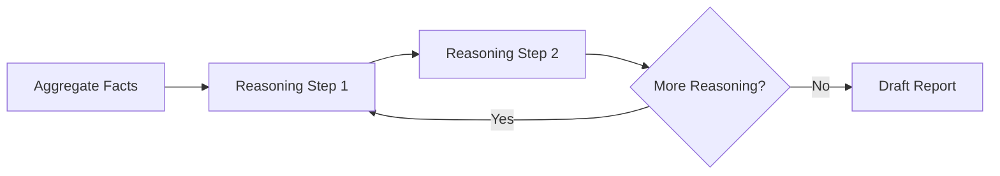

# 范式实现对比分析报告

> **ProAgent 架构 vs 参考实现对比**

---

## 📊 核心范式对比总结

| 范式 | 参考实现核心特征 | ProAgent 当前设计 | 符合度 | 改进建议 |
|:---|:---|:---|:---:|:---|
| **CoT** | 线性推理，多步骤串联 | ✅ Analyst 独立节点 | ⚠️ **60%** | 需明确推理步骤记录 |
| **ReAct** | Think→Act→Observe 循环 | ✅ Executor 内嵌 | ⚠️ **70%** | 需显式 Thought 记录 |
| **Plan-and-Execute** | Plan→Execute→Check Loop | ✅ Planner→Executor→Router | ✅ **90%** | 添加 Progress Check |

---

## 1. CoT (Chain-of-Thought) 分析

### 参考实现核心要点

```python
# 关键流程
Analyze Question → Reasoning (循环) → Conclude
```

**核心特征**:
1. ✅ **推理步骤显式记录**: 每一步推理都记录为 `reasoning_steps` 列表
2. ✅ **线性推导**: Analyze → Reason → Reason → Conclude
3. ✅ **Step-by-step 可见**: 每步包含 `step_name`, `content`, `reasoning`
4. ✅ **条件终止**: LLM 可判断 `can_conclude` 提前结束

**状态定义**:
```python
class CoTState(TypedDict):
    question: str
    reasoning_steps: List[Dict[str, str]]  # 关键！记录每步推理
    final_answer: str
    current_step: int
```

### ProAgent 当前设计

**当前实现 (Analyst Node)**:
- ✅ 输入: `research_findings` (事实集合)
- ✅ CoT Prompt: "Step 1: ..., Step 2: ..."
- ⚠️ **缺失**: 没有显式的 `reasoning_steps` 记录

**问题诊断**:
1. ❌ Analyst 是"一次性"生成报告，而非**循环推理**
2. ❌ 没有保存中间推理步骤
3. ❌ 无法验证每步推理的来源引用

### 改进建议

**方案 1: 拆分 Analyst 为多节点 (推荐)**



**方案 2: 在 Analyst 内部显式记录**

```python
class AgentState:
    # 新增字段
    analyst_reasoning_steps: List[Dict]  # 记录 CoT 推理轨迹
```

---

## 2. ReAct (Reasoning + Acting) 分析

### 参考实现核心要点

```python
# 关键循环
Think → Act → Observe → Think → ...
```

**核心特征**:
1. ✅ **Thought 显式化**: `thought` 字段独立存在
2. ✅ **Action 与 Observation 分离**: 
   - `action`: 工具名
   - `action_input`: 参数
   - `observation`: 结果
3. ✅ **历史记录**:
   ```python
   history: List[Dict[str, str]]  # [{type: "Thought", content: "..."}, ...]
   ```
4. ✅ **Max

 Iterations**: 硬编码循环上限 (20步)

**节点设计**:
- `think_node`: 分析状态 → 决定 action
- `act_node`: 执行工具 → 返回 observation
- Conditional Edge: `should_continue()`

### ProAgent 当前设计

**当前实现 (Executor Node)**:
```python
def executor_node(state):
    # 使用 create_react_agent (LangChain prebuilt)
    agent = create_react_agent(llm, tools)
    result = agent.invoke(...)
```

**优点**:
- ✅ 使用标准 ReAct Agent
- ✅ 内置 Tool 调用逻辑

**缺点**:
- ⚠️ **黑盒化**: `create_react_agent` 是封装好的，看不到内部 Thought
- ⚠️ **Observation 未显式记录到 State**
- ⚠️ **无法对 Thought 过程做精细控制**

### 对比差异

| 特性 | 参考实现 | ProAgent | 影响 |
|:---|:---|:---|:---|
| Thought 可见性 | ✅ 显式字段 | ❌ 隐藏在 Agent 内部 | 无法追踪推理 |
| 历史记录 | ✅ `history` 列表 | ⚠️ `messages` (仅当前任务) | 上下文不连贯 |
| Max Steps控制 | ✅ 显式检查 | ⚠️ 依赖 prebuilt 默认 | 失控风险 |

### 改进建议

**方案 1: 替换为自定义 ReAct Loop (推荐)**

```python
# 不使用 create_react_agent
def executor_node(state):
    # 手动实现 Thought
    thought = llm.invoke("Analyze current task...")
    
    # 手动 Action
    action, params = parse_action(thought)
    observation = tools[action].execute(params)
    
    # 记录到 State
    return {
        "messages": [...],
        "observations": [...],  # 新增
        "thought_history": [...]  # 新增
    }
```

**方案 2: Wrapper prebuilt Agent 并记录**

```python
# 包装 create_react_agent，拦截 messages
result = agent.invoke(...)
for msg in result["messages"]:
    if is_ai_message(msg):
        extract_thoughts.append(msg.content)
```

---

## 3. Plan-and-Execute 分析

### 参考实现核心要点

**核心流程**:
```python
Plan → Execute Step → Check Progress → (Loop or Finish)
```

**关键特征**:
1. ✅ **Plan 是结构化列表**:
   ```python
   plan: List[Dict]  # [{step_id, description, action_type}, ...]
   ```
2. ✅ **Progress Check 节点**: 评估完成度，决定是否重规划
3. ✅ **Step Results 累积**:
   ```python
   step_results: List[Dict]  # 每步执行结果
   ```
4. ✅ **Replan 机制**: `needs_replan` 触发重新规划

**节点设计**:
- `plan_node`: 生成 Plan
- `execute_step_node`: 执行单步
- `check_progress_node`: ⭐ **关键差异点**
- `finish_node`: 汇总

### ProAgent 当前设计

**当前实现**:
```python
Router → Planner → Executor → Router → ...
```

**优点**:
- ✅ Plan 结构化 (`List[PlanStep]`)
- ✅ 动态 Replanning (Router 判断)
- ✅ Step-by-step 执行

**缺点**:
- ❌ **缺少 Progress Check 节点**: Router 只判断 "是否还有步骤"，没有评估"进展是否合理"
- ⚠️ **Replan 触发条件不明确**: 何时触发重规划？

### 对比差异

| 特性 | 参考实现 | ProAgent | 影响 |
|:---|:---|:---|:---|
| Progress Check | ✅ 独立节点 | ❌ 无 | 无法评估进展质量 |
| Replan 触发 | ✅ 明确条件 | ⚠️ 仅 error_state | 缺乏主动调整 |
| Step Results | ✅ 累积记录 | ✅ `research_findings` | 符合 |

### 改进建议

**添加 Progress Check 节点**:

```python
def progress_check_node(state):
    plan = state["plan"]
    completed = state["current_step_index"]
    findings = state["research_findings"]
    
    # LLM 评估
    assessment = llm.invoke(f"""
    原始目标: {state['topic']}
    计划: {plan}
    已完成: {completed}/{len(plan)}
    当前发现: {findings}
    
    评估：
    1. 进展是否偏离目标？
    2. 是否需要调整后续计划？
    """)
    
    return {
        "needs_replan": assessment.needs_adjustment
    }
```

**Flow 更新**:
```
Executor → Progress Check → Router
                ↓ (if needs_replan)
              Planner
```

---

## 4. ProAgent 架构优化建议

### 优先级 1: ReAct Executor 透明化

**当前问题**: Executor 使用黑盒 `create_react_agent`，无法追踪 Thought。

**解决方案**: 自定义 ReAct Loop

```python
def executor_node(state):
    current_task = state["plan"][state["current_step_index"]]
    
    # 初始化循环
    thoughts = []
    observations = []
    max_steps = 15
    
    for step in range(max_steps):
        # 1. Think
        thought = think_llm.invoke(f"Task: {current_task}, Observations: {observations}")
        thoughts.append(thought)
        
        # 2. Act
        action, params = parse_thought(thought)
        if action == "finish":
            break
        observation = tools[action].execute(params)
        observations.append(observation)
    
    # 返回结构化结果
    return {
        "research_findings": [Fact(content=obs) for obs in observations],
        "executor_trace": {
            "thoughts": thoughts,
            "observations": observations
        }
    }
```

### 优先级 2: Analyst CoT 步骤记录

**当前问题**: Analyst 生成报告是一次性的，没有中间步骤。

**解决方案**: 多步推理

```python
def analyst_node(state):
    findings = state["research_findings"]
    
    reasoning_steps = []
    
    # Step 1: 市场规模分析
    step1 = llm.invoke("Analyze market size from findings...")
    reasoning_steps.append({"step": 1, "content": step1})
    
    # Step 2: 竞争格局
    step2 = llm.invoke(f"Based on {step1}, analyze competition...")
    reasoning_steps.append({"step": 2, "content": step2})
    
    # Step 3: 最终结论
    final = llm.invoke(f"Synthesize {reasoning_steps} into report...")
    
    return {
        "analyst_reasoning": reasoning_steps,
        "final_report": final
    }
```

### 优先级 3: 添加 Progress Check

**当前问题**: 缺少进度质量评估。

**解决方案**: 在 `workflow.py` 中添加节点

```python
graph.add_node("progress_check", progress_check_node)

# 修改边
graph.add_edge("executor", "progress_check")
graph.add_conditional_edges(
    "progress_check",
    lambda s: "replan" if s.get("needs_replan") else "router",
    {"replan": "planner", "router": "router"}
)
```

---

## 5. 最终评分与结论

| 维度 | 得分 | 说明 |
|:---|:---:|:---|
| **架构合理性** | ⭐⭐⭐⭐⭐ | 三层分级设计清晰 |
| **CoT 符合度** | ⭐⭐⭐ | 缺少显式步骤记录 |
| **ReAct 符合度** | ⭐⭐⭐⭐ | 功能完整但透明度不足 |
| **Plan-Execute 符合度** | ⭐⭐⭐⭐ | 缺少 Progress Check |
| **生产级特性** | ⭐⭐⭐⭐⭐ | HITL/Streaming/Persistence 完备 |

### 核心结论

**ProAgent 设计在宏观架构上优于参考实现**:
- ✅ 三范式**融合**而非单一使用
- ✅ Router 模式更灵活
- ✅ 生产级特性(HITL/SSE/Checkpointer)完整

**但在范式细节上需要对齐**:
- ⚠️ ReAct 的 Thought 应显式化
- ⚠️ CoT 的推理步骤应记录
- ⚠️ Plan-Execute 应添加 Progress Check

### 推荐行动

1. **Short-term**: 自定义 Executor ReAct Loop，替换 `create_react_agent`
2. **Mid-term**: 为 Analyst 添加多步推理记录
3. **Long-term**: 添加 Progress Check 节点，完善重规划逻辑
